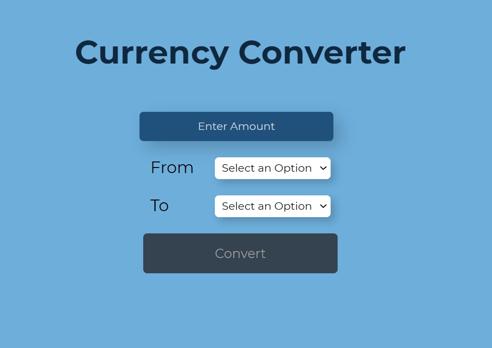

# A simple currency exchange rate calculator!

---

### How to use?
Try this calculator by visiting [this link](https://murtuzaalisurti.github.io/a-currency-converter) and just enter the amount of which you want to know the exchange rate!

---

### Which technologies are used?
A combination of HTML, CSS and JavaScript(Vanilla) coupled with some curiosity made this project possible!

Currency exchange rates are fetched from the following API:- [exchangeratesapi.io](https://github.com/exchangeratesapi/exchangeratesapi)

Read their [documentation](https://github.com/exchangeratesapi/exchangeratesapi#usage) for more information.

---

  
&nbsp;Which technologies are used?

  <pre>
    HTML
    CSS
    JavaScript</pre>
 

---

### How can I contribute?
Anyone with enough knowledge about web-development can contribute to this project. A necessary description is recommended along with the pull request explaining the changes you would like to make to this project. 
